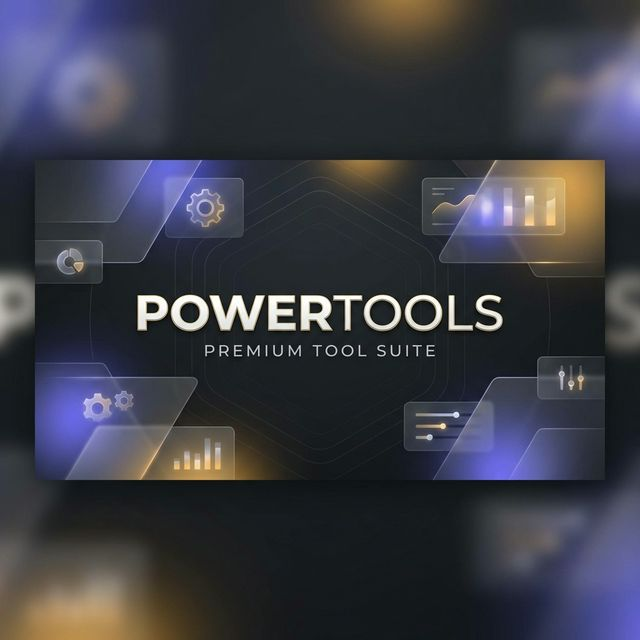

  

# ⚡ Powertools
### A Premium Dashboard of Targeted Decision Utilities

**Powertools** is a high-performance, utility-first suite designed for everyday workflows. From financial calculations to algorithm visualizations, every tool is crafted with a focus on **speed**, **ux-first design**, and **instant interactions**.

---

## 🌟 Key Features

| 🚀 **Instant Performance** | 🎨 **Premium Aesthetics** | 🌗 **Native Dark Mode** |
| :--- | :--- | :--- |
| Zero-frame loading with static skeletons & snapshot caching. | Hand-crafted glassmorphism and smooth, purposeful micro-animations. | Fully synchronized theme switching with settle-motion transitions. |

---

## 🛠️ Tool Categories

<b>💰 Finance & Planning</b>

Tools for calculated growth and tracking.
- **BMI Calculator**: Precision health metric tracking with dual-unit support.
- **Loan EMI Calculator**: Visual payment scheduling and interest analysis.
- **Net Worth Tracker**: Holistic asset-liability visualization.
- **Smart Car Expense Tracker**: Comprehensive vehicle cost management.

<b>🧩 Logic & Algorithms</b>

Visualizing the invisible.
- **Algorithm Visualizer**: Step-by-step interactive sorting and searching analysis.
- **Regex Tester**: Real-time pattern validation with edge-case detection.

<b>🛠️ Utilities & DevTools</b>

Purpose-built helpers for technical tasks.
- **JSON Formatter**: Clean, syntax-highlighted data structure viewing.
- **Base64 Converter**: Fast, bidirectional encoding tools.

---

## 🔗 Quick Start
1. **Explore Online**: **[sureshmopidevi.github.io/powertools](https://sureshmopidevi.github.io/powertools/)**
2. **Run Locally**: Clone the repo and open `index.html` in any modern browser.

---

## ✨ Design Philosophy
Powertools favors **Vanilla JavaScript** and **Custom CSS** over heavy frameworks. This allows for near-instant interaction times, minimal bundle sizes, and complete control over the visual "settle" and "shimmer" effects that define the premium experience.

---

  Built with <i class="fa-solid fa-heart text-rose-500 mx-0.5"></i> for practical, everyday workflows.

